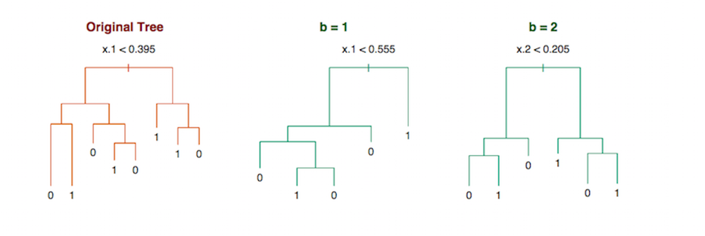
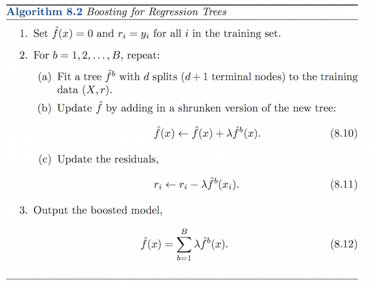
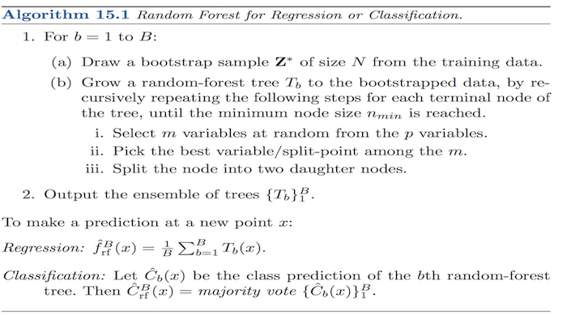
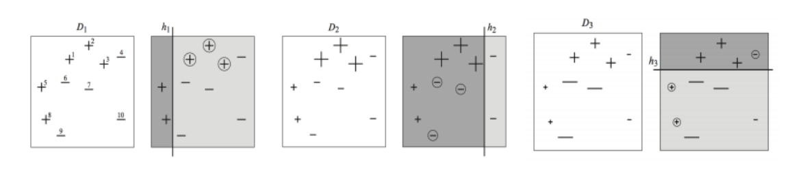
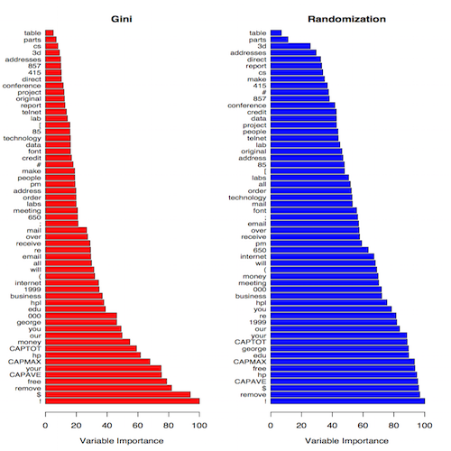
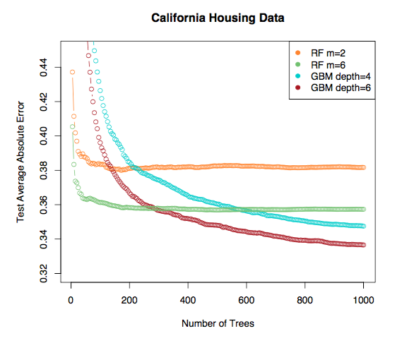

# Outline

1. 2W questions

2. Bagging 

3. Boosting 

4. Random Forest 

5. AdaBoost / Gradiant Boosting 

6. Conclusion

--- .class #id 

# 2W questions

- Why
  + Why this algorithm exists? (What kind of problem it solves?) 
- How
  + How this algorithm formulated?

--- 

# Why Bagging? 

> Bagging exploits that idea to address the `overfitting issue` in a more fundamental manner. It was invented by Leo Breiman, who called it "bootstrap aggregating" or simply "bagging" (reference: "Bagging predictors," Machine Learning, 24:123-140, 1996, cited by 7466).

### The decision trees suffer from `high variance` and `Bagging(Boostrap Aggregation)` is a procedure to reduce variance.

---

# How Bagging Works?

$$\hat{f}_{bag}(x) = \frac{1}{B}\sum_{B}^{b=1}\hat{f}^{*b}(x)$$

---
## Why Boosting? 

> The motivation for boosting was a procedure that combines the outputs of many “weak” classifiers to produce a powerful “committee.”

---

## How Boosting Works?

---

# Bagging V.S. Boosting

- Bagging reduce the variance

- Boosting learned from the mistakes.

---
# Why Random Forests? 

> Trees are ideal candidates for bagging, since they can capture complex interaction structures in the data, and if grown sufficiently deep, have relatively low bias. Since trees are `notoriously noisy`, they benefit greatly from the `averaging`. 

---

## **Random Forests = Bagging + C&RT decision trees** 

### Detail of Random Forests

- For classification, the default value for m is $\sqrt{p}$ and the minimum node size is one.
- For regression, the default value for m is $\frac{p}{3}$ and the minimum node size is five.

---
# How Random Forest Works?

---

# Why Boosting trees?

> Boosting tree can be considered as a human learning process. Trees are just like human decision-making process and boosting is a way to learn by weak learner, which means boosting + tree is learned by mistakes.

---

# How Boosting Work?

---

## Random Forests V.S. Boosting trees

- **Fature Importance**
- **Test-error Comparasion**
  

---

## Feature Importance 

---

## Test-error Comparasion

---

# Conclusion

>- **Generally, Boosting has better performance than Bagging. However, Sometimes Random Forests have better performance.**

>- **The advantage of Random Forests is more simple to train and tune than boosting trees.**

